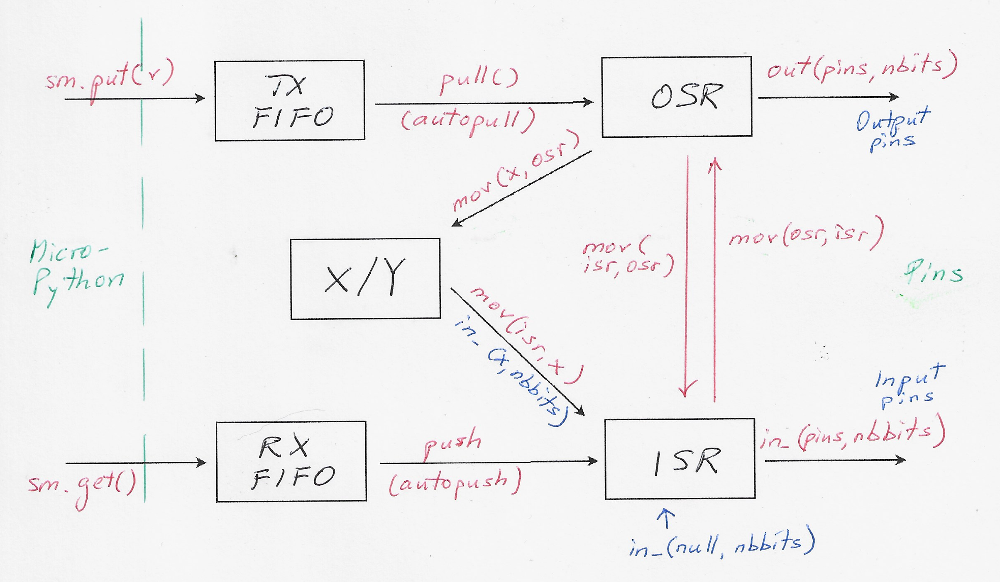

# PIO how do I ...

All examples have about the same import that is not listed for every example:

```python
import time
import machine
from rp2 import PIO, StateMachine, asm_pio
```
## Uncomple overview

Not shown here: set(pins, 0/1), jmp(pin, ...) and others


## Set pins, delay

```python
@asm_pio(set_init = PIO.OUT_LOW)
def pwm1():
    set(pins, 0)  [2]
    nop() [31]
    set(pins, 1)
sm = StateMachine(1, pwm1, freq= 40000, set_base = Pin(15))
```

[2] = delay of 2 clocks, max = 31 (together with sideset)

freq = 2000 ... 125_000_000

## Blink with 1Hz

```python
@asm_pio(set_init = PIO.OUT_LOW)
def blink():

    # half period with 1          Cycles:
    set(pins, 1)                  # 1 
    set(x, 31)      [6]           # 1 + 6

    label("delay_1")
    nop()           [29]          # (1+29) 
    jmp(x_dec, "delay_1")         #  1      = 31, * (31+1)

    # half period with 0
    set(pins, 0)

    set(x, 31)      [6]
    label("delay_0")
    nop()           [29]
    jmp(x_dec, "delay_0")


sm = StateMachine(1, blink, freq= 2000, set_base = led)
sm.active(1)
```

## Work with values >31 in X register

Register X can have 32bit values. 
5bit values (0...31) can be set directly mith set.
Bigger values >31 must be set indirectly:

### Load X

must be done in 3 steps:

- sm.put(value)    -> TX_FIFO

- pull()                   -> OSR

- mov(x, osr)       -> X

### Get X

- mov(isr, x)           -> ISR

- push()                   -> RX_FIFO

- sm.get()

#### Example: load X, decrement X, get X

```python
@asm_pio()
def test():
    pull()            # Pull a value from the TX FIFO into OSR
    mov(x, osr)     # Move the value from OSR to ISR

    jmp(x_dec, "next")
    label("next")

     mov (isr, x)
     push()            # Push ISR to RX FIFO

sm = StateMachine(0, test, freq=1_000_000)

input_value = 5347
sm.put(input_value)
sm.active(1)

time.sleep(0.1)  # Give time to execute

if sm.rx_fifo() > 0:
    output_value = sm.get()
    print("Input: ", input_value)
    print("Output: ", output_value)
```

### Operations on X

- Invert X:
  
  ```python
  mov(x, invert(x))
  ```

- Bit reverse X:
  
  ```python
  mov(x, reverse(x))
  ```

- Decrement X by 1:
  As there is no direct decrement operation we have to use jmp_dec
  ```python
  jmp(x_dec, "next")
  label("next")
  ```

- Increment X by 1:
  
  ```python
  mov(x, invert(x))
  jmp(x_dec, "next")
  label("next")
  mov(x, invert(x))
  ```
  
  X is inverted, decremented by 1, and inverted again.
  Example with 3 bit numbers:
  2 = 010, inv -> 101, -1 -> 100, inv. -> 011 = 3

## Wait for a signal

```python
wait(polarity, source, index)
```

polarity = 0/1

source: gpio / pin / irq
gpio = pin number direct, pin = relative to in_base
index :
    GPIO number if source = gpio
    pin relative to in_base if source = pin
    IRQ0...7 if source = irq


## Parallel output

Example: output sawtooth signal for DAC

```python
@asm_pio(out_init = (PIO.OUT_HIGH,) * 8, out_shiftdir = PIO.SHIFT_RIGHT)
def parallel_out():
    pull()
    out(pins, 8)
    

sm = StateMachine(0, parallel_out, freq = 1000_000, out_base = Pin(8))
sm.active(1)

while True:
    for i in range(255):
        sm.put(i)
```

## Measure pulse length
(See https://github.com/orgs/micropython/discussions/16725, thanks Peter Hinch!)
```python
inpin = Pin(16, Pin.IN, Pin.PULL_UP)

@rp2.asm_pio(set_init=rp2.PIO.IN_LOW, autopush=True, push_thresh=32)
def mark():
    set(x, 0)
    wait(0, pin, 0)  # Wait for pin to go low
    wait(1, pin, 0)  # Low to high transition
    label('low_high')
    jmp(x_dec, 'next') [1]  # unconditional
    label('next')
    jmp(pin, 'low_high')  # while pin is high
    in_(x, 32)  # Auto push: SM stalls if FIFO full
        
sm1 = rp2.StateMachine(1, mark, in_base=inpin, jmp_pin=inpin)
sm1.active(1)

# Clock is 125MHz. 3 cycles per iteration, so unit is 24.0ns
def scale(v):
    return (1 + (v ^ 0xffffffff)) * 24e-6  # Scale to ms

while True:
    mark = scale(sm1.get())
    print( mark)
    time.sleep(0.5)
```
At the beginning X is set to 0, so we are counting into negative numbers.

X is decremented as long as the input is high (note jmp_pin=inpin in StateMachine  definition).

At the end we add 1 to the inverted X to convert to a positive number


